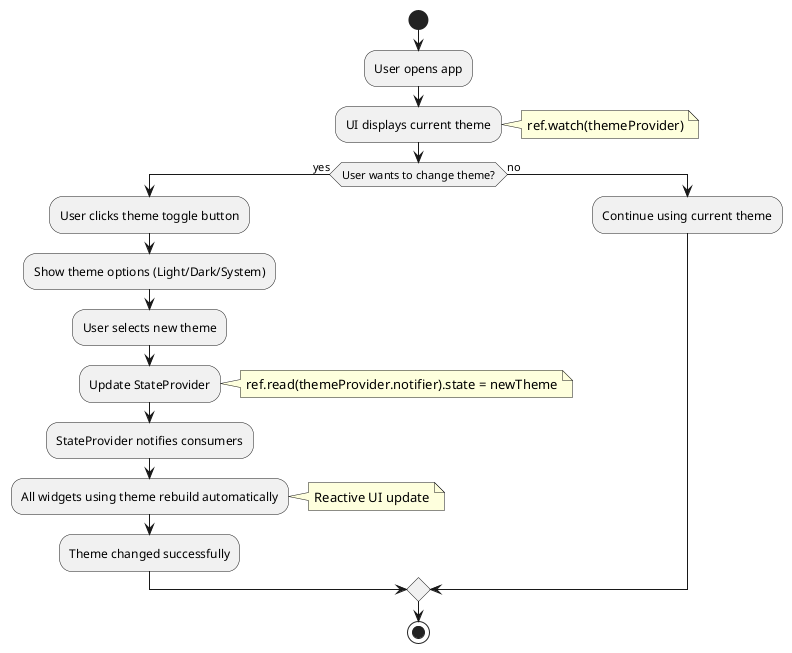
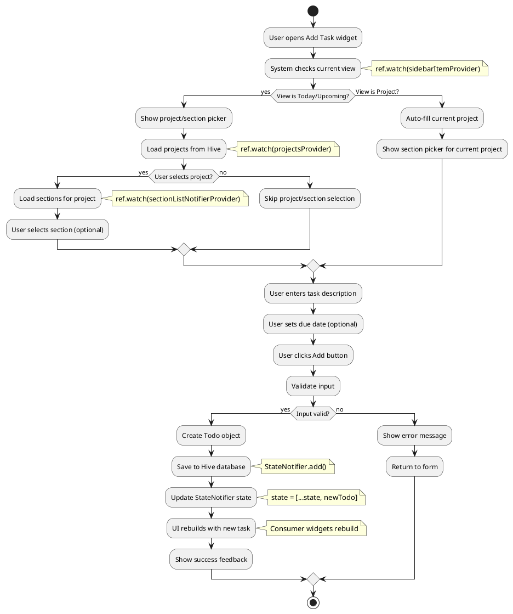
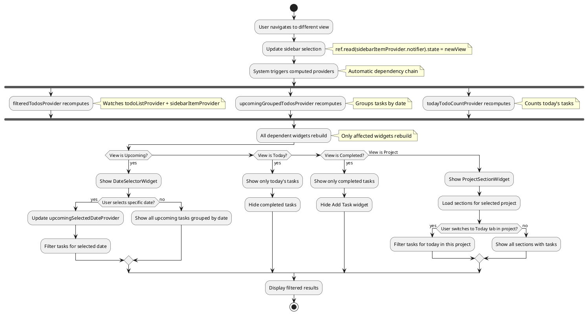
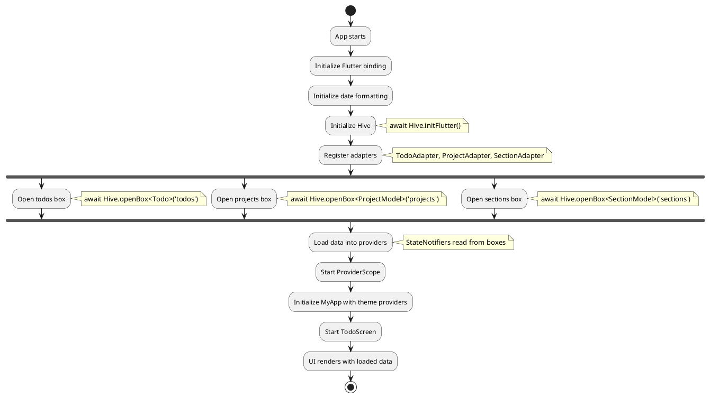
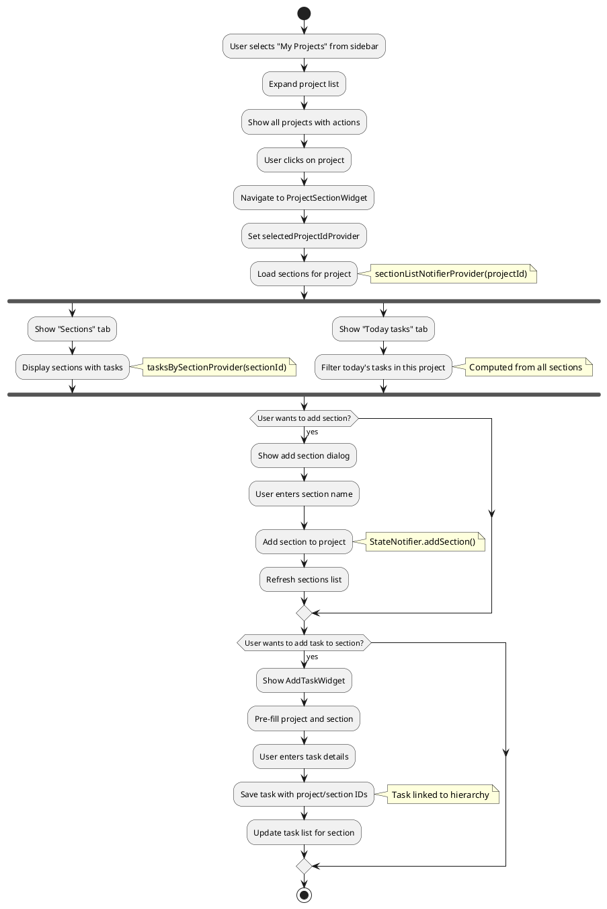

# Activity Diagram - Todo App Key Flows

## 1. Activity Diagram: Change Theme (Level 1 - StateProvider)

## 2. Activity Diagram: Add Task with Project/Section (Level 2 & 4)

## 3. Activity Diagram: Filter Tasks (Level 4 - Computed Providers)

## 4. Activity Diagram: App Initialization (Level 3 - FutureProvider concept)

## 5. Activity Diagram: Project-Section-Task Hierarchy

## Key Insights from Activity Diagrams

### **Riverpod Patterns Demonstrated:**

1. **Level 1 (StateProvider)**: Simple theme toggle với automatic UI rebuild
2. **Level 2 (StateNotifierProvider)**: Complex task management với business logic
3. **Level 4 (Computed Providers)**: Reactive filtering và dependency chains

### **Data Flow:**
- **Unidirectional**: User action → Provider update → UI rebuild
- **Reactive**: Dependent providers tự động recompute
- **Persistent**: Hive integration trong StateNotifier methods

### **UI Patterns:**
- **Consumer widgets**: Automatic rebuild khi provider changes
- **Conditional rendering**: Based on provider state
- **Form handling**: Validation và error states