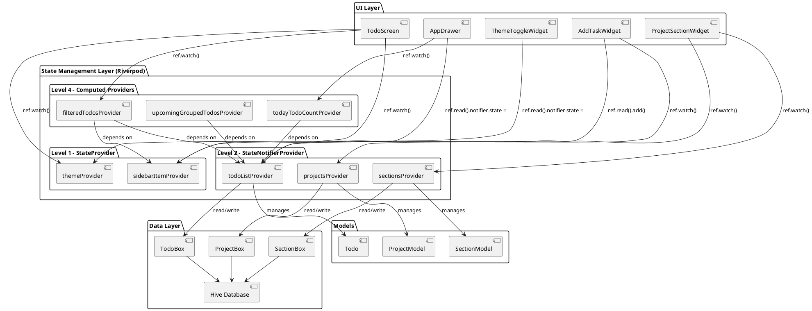
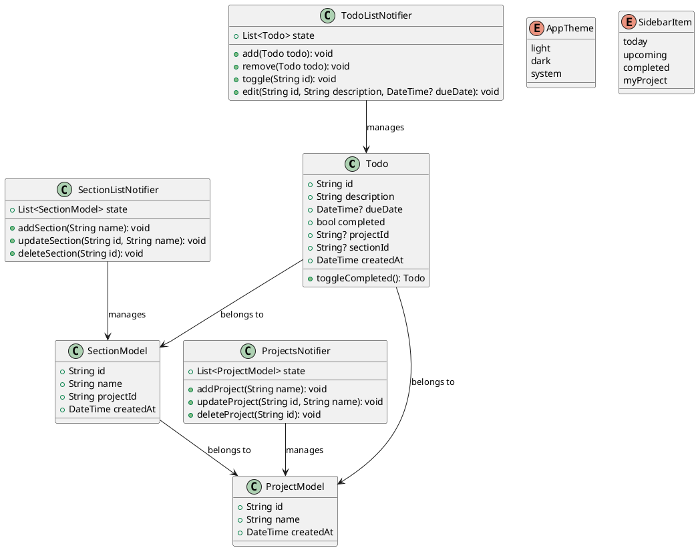
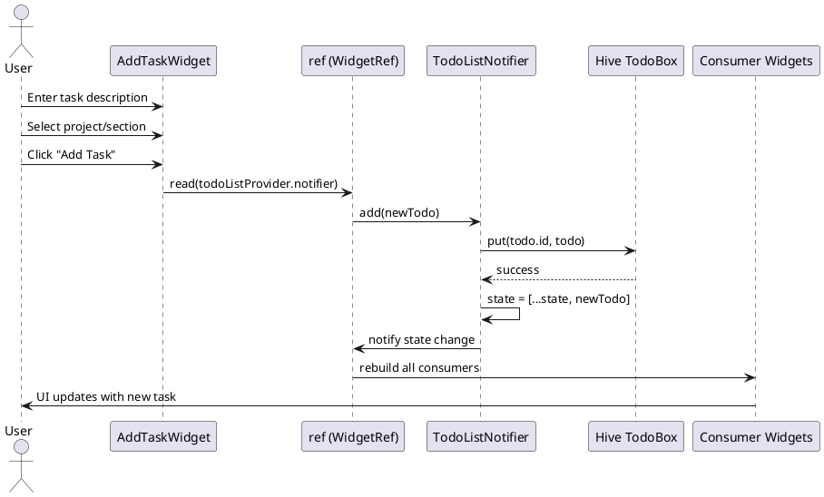

# System Architecture Overview

## Component Diagram - Riverpod Architecture



## Class Diagram - Core Models and Providers



## Sequence Diagram - Add Task Flow



## Data Flow Diagram

```
┌─────────────────┐    ┌──────────────────┐    ┌─────────────────┐
│   User Input    │───▶│  Riverpod State  │───▶│   UI Widgets    │
│                 │    │   Management     │    │                 │
│ • Theme toggle  │    │                  │    │ • Auto rebuild  │
│ • Add task      │    │ Level 1: Simple  │    │ • Reactive UI   │
│ • Edit task     │    │ Level 2: Complex │    │ • Conditional   │
│ • Navigate      │    │ Level 4: Computed│    │   rendering     │
└─────────────────┘    └──────────────────┘    └─────────────────┘
                                │
                                ▼
                       ┌─────────────────┐
                       │ Hive Local DB   │
                       │                 │
                       │ • Persistent    │
                       │ • Offline       │
                       │ • Type-safe     │
                       └─────────────────┘
```