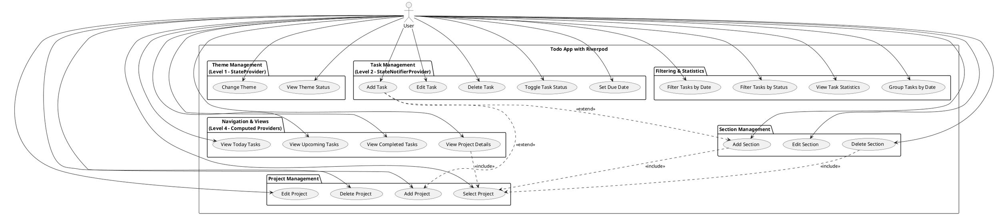

# Use Case Diagram - Todo App with Riverpod

## Actors
- **User (Người dùng)**: Người sử dụng ứng dụng quản lý công việc

## Use Cases

### 📱 **Theme Management (Cấp độ 1 - StateProvider)**
1. **Change Theme**
   - Switch to Light Theme
   - Switch to Dark Theme  
   - Switch to System Theme
   - View Current Theme Status

### 📝 **Task Management (Cấp độ 2 - StateNotifierProvider)**
2. **Manage Tasks**
   - Add New Task
   - Edit Task Description
   - Set Task Due Date
   - Mark Task as Completed/Uncompleted
   - Delete Task
   - View Task Details (Project/Section info)

### 📁 **Project Management**
3. **Manage Projects**
   - Add New Project
   - Rename Project
   - Delete Project
   - Select Project to View

### 🗂️ **Section Management**
4. **Manage Sections**
   - Add Section to Project
   - Edit Section Name
   - Delete Section
   - View Tasks in Section

### 🧭 **Navigation & Views (Cấp độ 4 - Computed Providers)**
5. **Navigate Between Views**
   - View Today Tasks
   - View Upcoming Tasks
   - View Completed Tasks
   - View Project Details
   - View Section Details

### 🔍 **Filtering & Grouping (Cấp độ 4)**
6. **Filter Tasks**
   - Filter by Date (Today/Upcoming)
   - Filter by Completion Status
   - Filter by Project
   - Filter by Section
   - View Today Tasks in Project

### 📊 **Statistics & Computed Data**
7. **View Statistics**
   - View Today Task Count
   - View Tasks by Date Groups
   - View Task Progress

## PlantUML Code

## Mô tả chi tiết Use Cases

### **UC1: Change Theme (Level 1)**
- **Actor**: User
- **Description**: Người dùng thay đổi theme của ứng dụng
- **Riverpod**: StateProvider
- **Flow**: User clicks theme button → StateProvider updates → UI rebuilds

### **UC2-6: Task Management (Level 2)**
- **Actor**: User  
- **Description**: CRUD operations cho tasks
- **Riverpod**: StateNotifierProvider
- **Persistence**: Hive local storage

### **UC14-17: Navigation (Level 4)**
- **Actor**: User
- **Description**: Chuyển đổi giữa các view
- **Riverpod**: Computed Providers
- **Features**: Reactive filtering, automatic grouping

## Relationships
- **Include**: UC17 (View Project) bao gồm UC10 (Select Project)
- **Extend**: UC2 (Add Task) có thể mở rộng với UC7 (Add Project), UC11 (Add Section)